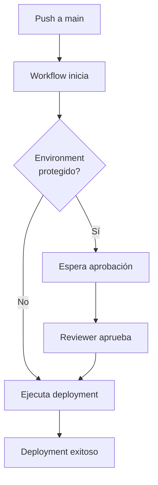

# 🚀 Configuración de Deployment con GitHub Environments

## 📋 Configuración del Environment "deploy"

Para configurar el deployment seguro usando GitHub Environments, sigue estos pasos según la documentación oficial de GitHub:

### 1. 🛡️ Crear el Environment "deploy"

1. Ve a tu repositorio en GitHub
2. Navega a **Settings** → **Environments** 
3. Haz clic en **New environment**
4. Nombra el environment: `deploy` (los nombres no distinguen entre mayúsculas y minúsculas)
5. Haz clic en **Configure environment**

> **Nota**: Los nombres de environment no deben exceder 255 caracteres y deben ser únicos dentro del repositorio.

### 2. 🔐 Configurar Protection Rules

En la configuración del environment "deploy", puedes establecer las siguientes reglas de protección:

#### **Required reviewers**
- ✅ Marca "Required reviewers"
- Añade usuarios o equipos que deben aprobar deployments
- Máximo 6 reviewers

#### **Wait timer**
- ⏱️ Configura un tiempo de espera (opcional)
- Útil para deployments programados

#### **Deployment branches**
- 🌿 Restringir a ramas específicas:
  - Selecciona "Selected branches"
  - Añade regla: `main`
  - Esto asegura que solo deployments desde `main` sean permitidos

### 3. 🔑 Configurar Secrets del Environment

En la sección **Environment secrets**, añade los siguientes secrets:

#### **OVPN_CONFIG**
```bash
# Contenido completo de tu archivo .ovpn
# Ejemplo:
client
dev tun
proto udp
remote tu-servidor-vpn.com 1194
resolv-retry infinite
nobind
persist-key
persist-tun
ca [inline]
cert [inline]
key [inline]
# ... resto de la configuración
```

#### **SSH_PASSWORD**
```
tu_password_ssh_seguro
```

### 4. 📝 Variables de Environment (Opcional)

En **Environment variables**, puedes configurar:

| Variable | Valor | Descripción |
|----------|-------|-------------|
| `SSH_HOST` | `10.8.0.1` | IP del servidor de producción |
| `SSH_USER` | `root` | Usuario SSH |
| `DEPLOY_PATH` | `/var/www/guiders` | Ruta de deployment |
| `NODE_VERSION` | `20` | Versión de Node.js |

> **Nota**: Las variables en el workflow tienen precedencia sobre las variables del environment.

## 🔄 Flujo de Deployment con Environment

### Deployment Automático


### Deployment Manual
1. Ve a **Actions** en tu repositorio
2. Selecciona el workflow "Deploy Angular SSR to Production"
3. Haz clic en **Run workflow**
4. Selecciona la rama `main`
5. Haz clic en **Run workflow**

## 🛠️ Configuración Avanzada

### Múltiples Environments

Si necesitas múltiples environments (staging, production), crea workflows separados:

```yaml
# .github/workflows/deploy-staging.yml
jobs:
  deploy:
    environment: staging
    # ... configuración para staging

# .github/workflows/deploy-production.yml
jobs:
  deploy:
    environment: production
    # ... configuración para producción
```

### Notificaciones de Deployment

GitHub enviará notificaciones automáticamente para:
- ✅ Deployments exitosos
- ❌ Deployments fallidos
- ⏳ Deployments pendientes de aprobación

### Monitoreo de Deployments

- 📊 Ve el historial en **Actions** → **Deployments**
- 🔍 Cada deployment muestra logs detallados
- 📈 Métricas de tiempo y frecuencia de deployments

## 🚨 Mejores Prácticas de Seguridad

### 1. **Secrets Management**
- ❌ Nunca hardcodees secrets en el código
- ✅ Usa siempre GitHub Secrets o Environment Secrets
- 🔄 Rota secrets regularmente

### 2. **Branch Protection**
- 🛡️ Protege la rama `main`
- ✅ Requiere pull request reviews
- 🧪 Requiere que los tests pasen

### 3. **Environment Protection**
- 👥 Configura required reviewers para producción
- ⏱️ Usa wait timers para deployments críticos
- 🌿 Restringe a ramas específicas

### 4. **Monitoring**
- 📋 Revisa logs de deployment regularmente
- 🚨 Configura alertas para fallos
- 📊 Monitorea métricas de la aplicación post-deployment

## 🔧 Troubleshooting

### Error: "Environment not found"
- Verifica que el environment "deploy" exista
- Asegúrate de tener permisos de administrador

### Error: "Waiting for approval"
- Check si hay required reviewers configurados
- Contacta a los reviewers para aprobación

### Error: "Secret not found"
- Verifica que los secrets estén configurados en el environment
- Check los nombres de los secrets (case-sensitive)

## 📚 Referencias

- [GitHub Environments Documentation](https://docs.github.com/es/actions/managing-workflow-runs-and-deployments/managing-deployments/managing-environments-for-deployment)
- [GitHub Secrets Documentation](https://docs.github.com/es/actions/security-for-github-actions/using-secrets-in-github-actions)
- [GitHub Actions Deployment](https://docs.github.com/es/actions/managing-workflow-runs-and-deployments/managing-deployments/about-deployments)
