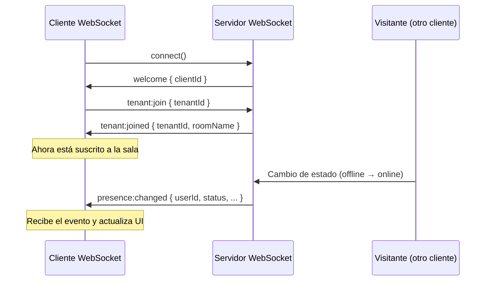

# WebSocket Testing - Eventos de Presencia

Este documento describe cómo probar la configuración del WebSocket para eventos `presence:changed`.

## 📋 Información del Test

- **Tenant ID**: `83504359-b783-41dd-bee1-5237c009179d`
- **Visitor ID**: `9598b495-205c-46af-9c06-d5dffb28ee21`
- **Evento**: `presence:changed`
- **Cambio esperado**: `offline → online`

## 🧪 Tests Automatizados (Playwright)

### Prerequisitos

⚠️ **IMPORTANTE**: El backend WebSocket debe estar corriendo en `http://localhost:3000`

```bash
# En una terminal separada, asegúrate de que el backend está corriendo
# (Esto depende de tu configuración de backend)
```

Si tu backend usa un puerto diferente, puedes especificarlo:

```bash
export WS_URL=http://localhost:PUERTO_DEL_BACKEND
```

### Ejecutar Tests

```bash
# Desde el directorio raíz del proyecto
cd apps/console-e2e

# Ejecutar solo el test de WebSocket en Chrome
npx playwright test websocket-presence --project=chromium

# Ejecutar en todos los navegadores
npx playwright test websocket-presence

# Ejecutar en modo UI (ver test en tiempo real)
npx playwright test websocket-presence --ui

# Ejecutar con debug
npx playwright test websocket-presence --debug

# Ver lista de tests disponibles
npx playwright test websocket-presence --list
```

### ¿Qué verifican los tests?

Los tests verifican:

1. ✅ **Conexión exitosa** al servidor WebSocket
2. ✅ **Unión a sala del tenant** usando `tenant:join`
3. ✅ **Recepción del evento** `tenant:joined`
4. ✅ **Configuración del listener** para `presence:changed`
5. ✅ **Estructura correcta** de los eventos recibidos

### Limitaciones

Los tests **NO** pueden simular el evento `presence:changed` directamente porque esto debe venir del backend cuando:

- Un visitante cambia de estado (offline → online, etc.)
- Un comercial cambia de estado
- Se detecta actividad/inactividad

Para probar la recepción completa de eventos, necesitas simular cambios de estado reales en el backend.

## 🔧 Testing Manual con Cliente WebSocket

Se incluye un helper para testing manual: `websocket-test-client.ts`

### Opción 1: Usar en un test de Playwright

```typescript
import { test } from '@playwright/test';
import { WebSocketTestClient } from './helpers/websocket-test-client';

test('mi test personalizado', async () => {
  const client = new WebSocketTestClient('http://localhost:3000');

  await client.connect();
  await client.joinTenantRoom('tenant-id');

  client.onPresenceChanged((event) => {
    console.log('Evento recibido:', event);
  });

  // ... resto del test

  client.disconnect();
});
```

### Opción 2: Script independiente Node.js

Crea un archivo `test-ws.ts`:

```typescript
import { WebSocketTestClient } from './apps/console-e2e/src/helpers/websocket-test-client';

async function main() {
  const TENANT_ID = '83504359-b783-41dd-bee1-5237c009179d';
  const client = new WebSocketTestClient('http://localhost:3000');

  try {
    console.log('Conectando...');
    await client.connect();

    console.log('Uniéndose a sala del tenant...');
    await client.joinTenantRoom(TENANT_ID);

    console.log('Escuchando eventos...');
    client.onPresenceChanged((event) => {
      console.log('Evento presence:changed:', event);
    });

    // Mantener vivo
    await new Promise(() => {});

  } catch (error) {
    console.error('Error:', error);
  } finally {
    client.disconnect();
  }
}

main();
```

Ejecutar:

```bash
npx ts-node test-ws.ts
```

## 🎯 Verificar Configuración

### 1. Verificar que el servicio WebSocket está configurado

```typescript
// libs/chat/data-access/websocket-service/src/lib/websocket.service.ts
joinTenantPresenceRoom(tenantId: string): void {
  // Debe emitir: tenant:join
  // Debe escuchar: tenant:joined y presence:changed
}
```

### 2. Verificar que el backend emite eventos

El backend debe:

1. Aceptar el evento `tenant:join` con payload: `{ tenantId: string }`
2. Responder con evento `tenant:joined`
3. Emitir eventos `presence:changed` a la sala `tenant:{tenantId}` cuando:
   - Un visitante del tenant cambia de estado
   - Un comercial del tenant cambia de estado

### 3. Estructura del evento esperada

```typescript
interface PresenceChangedEvent {
  userId: string;           // ID del usuario que cambió
  userType: 'commercial' | 'visitor';
  status: 'online' | 'offline' | 'away' | 'busy' | 'chatting';
  previousStatus: 'online' | 'offline' | 'away' | 'busy' | 'chatting';
  timestamp: string;        // ISO 8601
}
```

## 🐛 Debugging

### Ver logs del WebSocket en el navegador

1. Abrir DevTools
2. En la consola, buscar logs con prefijo `[WebSocket]`
3. Filtrar por: `presence` o `tenant`

### Ver eventos en tiempo real

```typescript
// En la consola del navegador
window.wsService = inject(WebSocketService);
window.wsService.on('presence:changed', (data) => {
  console.log('Evento recibido:', data);
});
```

### Verificar que estás suscrito a la sala

```typescript
// En la consola del navegador
console.log(window.wsService.currentRooms());
// Debe incluir: Set(['tenant:83504359-b783-41dd-bee1-5237c009179d'])
```

## 📊 Ejemplo de Flujo Completo



## 🔗 Referencias

- Servicio WebSocket: `libs/chat/data-access/websocket-service/src/lib/websocket.service.ts`
- Tipos de presencia: `libs/shared/types/src/lib/presence.types.ts`
- Tests e2e: `apps/console-e2e/src/websocket-presence.spec.ts`
- Helper de testing: `apps/console-e2e/src/helpers/websocket-test-client.ts`

## ✅ Checklist de Verificación

- [ ] El servicio WebSocket se conecta correctamente
- [ ] El evento `tenant:join` se emite con el tenantId correcto
- [ ] Se recibe el evento `tenant:joined` con la información correcta
- [ ] El listener de `presence:changed` está configurado
- [ ] Los eventos `presence:changed` tienen la estructura correcta
- [ ] La sala del tenant es: `tenant:83504359-b783-41dd-bee1-5237c009179d`
- [ ] Los eventos se reciben cuando un visitante cambia de estado

## 📝 Notas

- Los tests usan `socket.io-client` v4.8.1
- La conexión se hace a `http://localhost:3000` por defecto
- Los tests usan `transports: ['websocket', 'polling']` para máxima compatibilidad
- Se incluye `withCredentials: true` para enviar cookies
