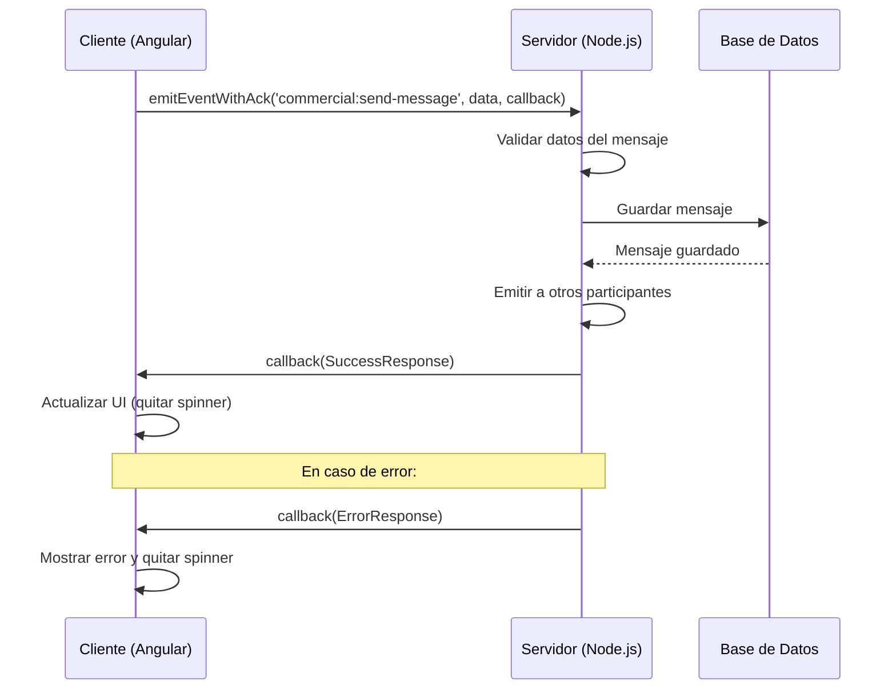

# WebSocket con Acknowledgments - Implementación Actualizada

## 🔄 Cambio de Estrategia: Eventos Separados → Acknowledgments

La implementación ha sido actualizada para usar **acknowledgments** de Socket.IO en lugar de eventos separados de respuesta.

### ❌ Problema Anterior:
- Cliente enviaba evento `commercial:send-message`
- Cliente esperaba eventos `commercial:message-sent` o `commercial:message-error`
- **Timeout de 5 segundos** causaba warnings innecesarios

### ✅ Solución Actual:
- Cliente envía evento con **callback de acknowledgment**
- Servidor responde **inmediatamente** usando el callback
- **Sin timeouts** ni esperas innecesarias

## 📨 Estructuras de Datos

### Interface Event (Envío)
```typescript
export interface Event {
  type?: string;
  data: Record<string, unknown>;
  metadata?: Record<string, unknown>;
  timestamp: number;
}
```

### Interfaces de Respuesta (Acknowledgment)
```typescript
export interface ErrorResponse {
  error: string;
  timestamp: number;
}

export interface SuccessResponse<T extends Record<string, unknown>> {
  type: string;
  message: string;
  timestamp: number;
  data: T;
}

export type Response<T extends Record<string, unknown>> =
  | ErrorResponse
  | SuccessResponse<T>;
```

## 🚀 Implementación Frontend

### WebSocketService - Método con Acknowledgment
```typescript
emitEventWithAck<T extends Record<string, unknown>>(
  eventName: string, 
  data?: Record<string, unknown>
): Promise<ErrorResponse | SuccessResponse<T>> {
  return new Promise((resolve, reject) => {
    if (!this.socket?.connected) {
      reject({ error: 'No hay conexión WebSocket activa', timestamp: Date.now() });
      return;
    }

    const eventPayload: Event = {
      type: eventName,
      data: data || {},
      metadata: {
        clientId: this.socket.id || 'unknown',
        userAgent: navigator.userAgent,
        origin: window.location.origin
      },
      timestamp: Date.now()
    };

    // Enviar con callback para acknowledgment (timeout 10s)
    const timeout = setTimeout(() => {
      reject({ error: 'Timeout al esperar respuesta del servidor', timestamp: Date.now() });
    }, 10000);

    this.socket.emit(eventName, eventPayload, (response: ErrorResponse | SuccessResponse<T>) => {
      clearTimeout(timeout);
      
      if ('error' in response) {
        reject(response);
      } else {
        resolve(response);
      }
    });
  });
}
```

### ChatComponent - Envío con async/await
```typescript
async sendMessage() {
  const message = this.currentMessageText().trim();
  const chat = this.selectedChat();
  
  if (!message || !chat || this.isSendingMessage()) return;
  
  if (!this.webSocketService.isConnected()) {
    console.warn('💬 [Chat] No hay conexión WebSocket activa');
    return;
  }
  
  this.isSendingMessage.set(true);
  
  const messageId = this.generateMessageId();
  const timestamp = Date.now();
  
  try {
    // Enviar mensaje y esperar respuesta del servidor
    const response = await this.webSocketService.emitEventWithAck('commercial:send-message', {
      id: messageId,
      message,
      timestamp,
      chatId: chat.id
    });
    
    console.log('✅ [Chat] Mensaje enviado exitosamente:', response);
    
    // Limpiar UI al recibir confirmación
    this.currentMessageText.set('');
    this.textareaRows.set(1);
    this.isSendingMessage.set(false);
    
  } catch (error) {
    console.error('❌ [Chat] Error al enviar mensaje:', error);
    this.isSendingMessage.set(false);
    
    // Mostrar error específico del servidor si está disponible
    if ('error' in error) {
      console.error('Error del servidor:', error.error);
    }
  }
}
```

## 🔧 Implementación Backend

### Manejo del Evento con Callback
```javascript
socket.on('commercial:send-message', (eventData, callback) => {
  const { type, data, metadata, timestamp } = eventData;
  const { id, message, chatId } = data;
  
  console.log('📨 Evento recibido:', type);
  console.log('📝 Datos del mensaje:', data);
  console.log('🔍 Metadata del cliente:', metadata);
  
  try {
    // Validar datos del mensaje
    if (!message || !chatId) {
      return callback({
        error: 'Datos del mensaje incompletos',
        timestamp: Date.now()
      });
    }
    
    if (!message.trim()) {
      return callback({
        error: 'El mensaje no puede estar vacío',
        timestamp: Date.now()
      });
    }
    
    // Validar que el chat existe
    const chat = findChatById(chatId);
    if (!chat) {
      return callback({
        error: 'Chat no encontrado',
        timestamp: Date.now()
      });
    }
    
    // Procesar y guardar el mensaje
    const savedMessage = saveMessageToDatabase({
      id,
      message: message.trim(),
      chatId,
      senderId: socket.userId, // Del token JWT
      timestamp: Date.now()
    });
    
    // Emitir el mensaje a otros participantes del chat
    socket.to(`chat:${chatId}`).emit('new-message', {
      type: 'new-message',
      data: savedMessage,
      timestamp: Date.now()
    });
    
    // Responder con éxito usando el callback
    callback({
      type: 'commercial:message-sent',
      message: 'Mensaje enviado exitosamente',
      timestamp: Date.now(),
      data: {
        messageId: id,
        chatId: chatId,
        processedAt: Date.now(),
        savedMessage: savedMessage
      }
    });
    
  } catch (error) {
    console.error('❌ Error al procesar mensaje:', error);
    
    // Responder con error usando el callback
    callback({
      error: error.message || 'Error interno del servidor',
      timestamp: Date.now()
    });
  }
});
```

## 🌟 Ventajas de los Acknowledgments

### ✅ **Inmediatez**
- Respuesta instantánea del servidor
- Sin timeouts innecesarios
- Feedback inmediato al usuario

### ✅ **Simplicidad**
- Un solo flujo request-response
- Sin eventos separados para manejar
- Código más limpio y mantenible

### ✅ **Confiabilidad**
- Garantía de entrega de respuesta
- Manejo robusto de errores
- Timeout configurable por operación

### ✅ **Tipado Fuerte**
- TypeScript completo en frontend
- Interfaces bien definidas
- Detección de errores en compile-time

## 📊 Flujo de Datos Completo



## 🧪 Testing y Debugging

### Logs del Cliente
```
📤 [Chat] Enviando mensaje vía WebSocket: {id, message, chatId, timestamp}
WebSocket: Enviando evento 'commercial:send-message' con ACK: {eventPayload}
✅ [Chat] Mensaje enviado exitosamente: {response}
```

### Logs del Servidor
```
📨 Evento recibido: commercial:send-message
📝 Datos del mensaje: {id, message, chatId, timestamp}
🔍 Metadata del cliente: {clientId, userAgent, origin}
✅ Mensaje procesado y guardado exitosamente
```

## 🚨 Manejo de Errores

### Errores del Cliente
- `No hay conexión WebSocket activa`
- `Timeout al esperar respuesta del servidor`

### Errores del Servidor
- `Datos del mensaje incompletos`
- `El mensaje no puede estar vacío`
- `Chat no encontrado`
- `Error interno del servidor`

---

**✅ Implementación con acknowledgments completada y funcionando correctamente**

**🎯 Próximo paso:** Testing con el backend real para validar la integración completa
